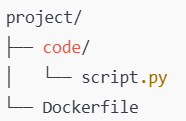

># 1. Utwórz plik z obrazem Dockerfile, w którym z hosta do kontenera kopiowany będzie folder code (zawiera np. jeden skrypt w języku Python 🐍) i zbuduj go: 
>* # uruchom ww. skrypt wewnątrz kontenera.  

struktura projektu:  
  

`code/script.py`:  
```py
print("Hello from Docker!")
```

`Dockerfile`:
```Dockerfile
# Użycie obrazu bazowego z Pythonem
FROM python:3.9-slim

# Ustawienie katalogu roboczego wewnątrz kontenera
WORKDIR /app

# Skopiowanie folderu code z hosta do kontenera
COPY code /app/code

# Ustawienie folderu code jako domyślnego miejsca pracy
WORKDIR /app/code

# Domyślna komenda uruchamiająca kontener
CMD ["python", "script.py"]
```  

Budowanie obrazu (z folderu gdzie jest *Dockerfile*):  
```bash
docker build -t my-python-app .
```  

Uruchamianie kontenera:  
```bash
docker run --rm my-python-app
```

Uruchomienie wewnątrz kontenera:  
```bash
docker run -it --rm my-python-app /bin/bash
```  
```bash
cd /app/code
```
```bash
python script.py
```  
