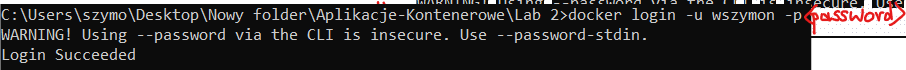

# 12. Zbuduj wybrany przez siebie obraz, nadaj mu 'tag' i opublikuj na DockerHubie. Następnie usuń lokalnie ww. obraz i pobierz go z DockerHuba. 

```sh
docker login -u wszymon -p <password>
```  


`Dockerfile`: 
```dockerfile
FROM ubuntu:22.04
RUN apt-get update && apt-get install -y curl
CMD ["echo", "Hello from Docker!"]
```

```sh
docker build -t wszymon/my-image:2.0 .
```

```sh
docker push wszymon/my-image:2.0
```

```sh
docker rmi wszymon/my-image:2.0
```

```sh
docker pull wszymon/my-image:2.0
```

```sh
docker run --rm wszymon/my-image:2.0
```