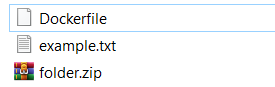

# 6. Pokaż działanie komend ADD i COPY i WORKDIR w wybranym projekcie.

struktura:  


`Dockerfile`:  
```dockerfile
FROM ubuntu:22.04

# katalog roboczy
WORKDIR /app

# Dodanie pliku za pomocą COPY
COPY example.txt /app/example_copy.txt

# Dodanie i rozpakowanie archiwum za pomocą ADD
ADD folder.zip /app/extracted/

# Komenda uruchamiająca kontener
CMD ["ls", "-la", "/app"]
```  

```bash
docker build -t demo-add-copy-workdir .
```

```sh
docker run --rm demo-add-copy-workdir
```

* `ADD`: Kopiuje pliki z hosta do kontenera i może dodatkowo rozpakować archiwa.  
* `COPY`: Kopiuje pliki z hosta do kontenera (bez dodatkowych funkcji).  
* `WORKDIR`: Ustawia katalog roboczy wewnątrz kontenera.  