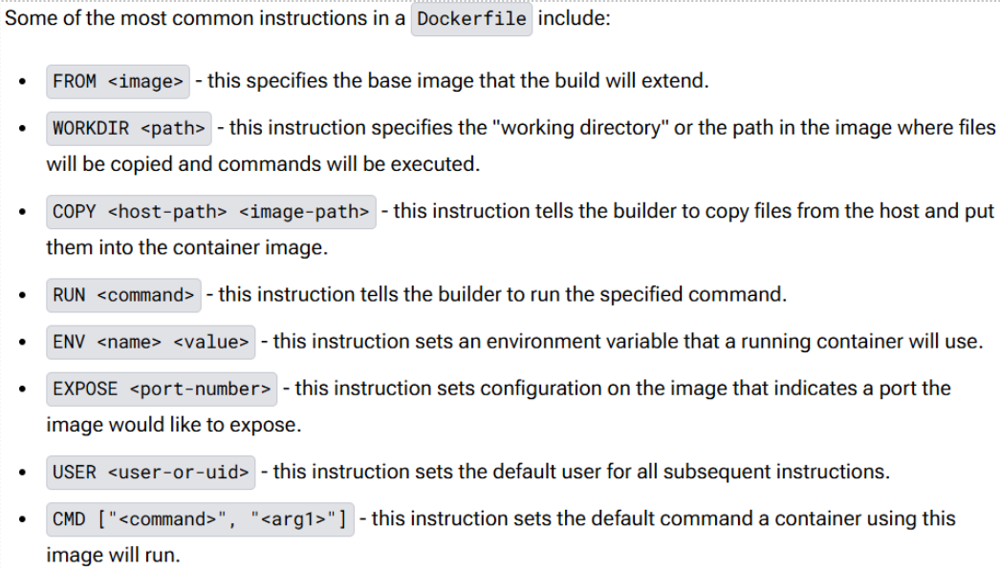
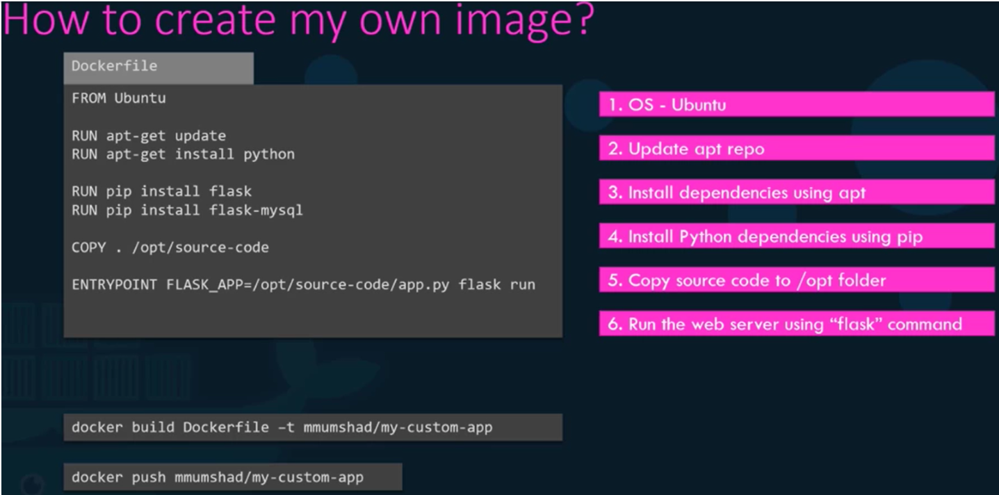
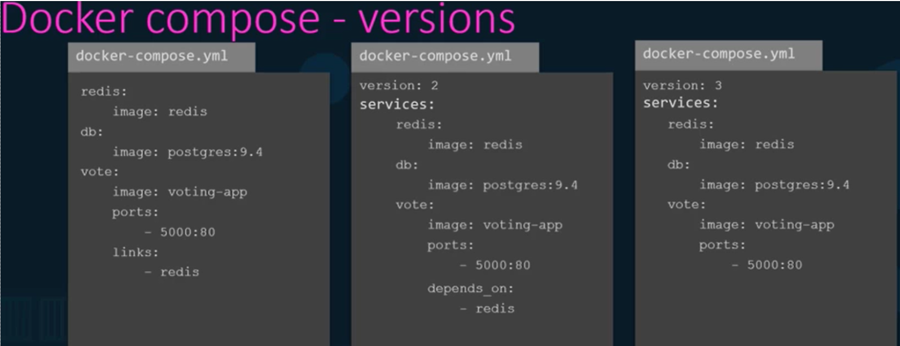
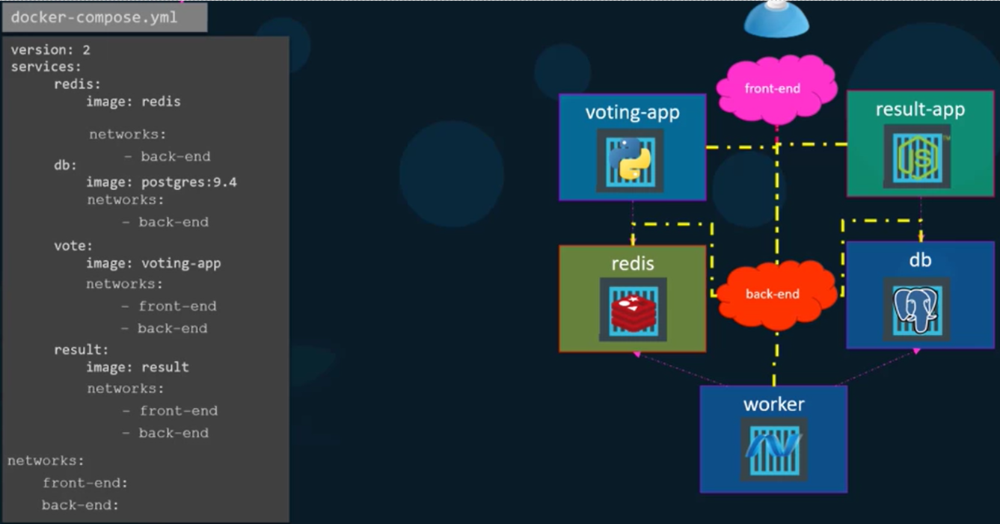
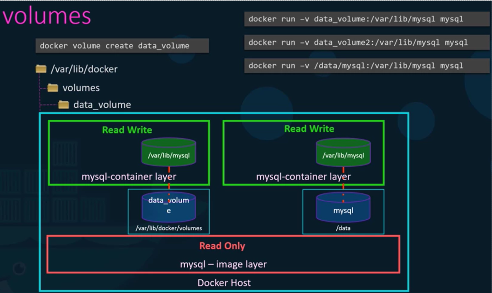
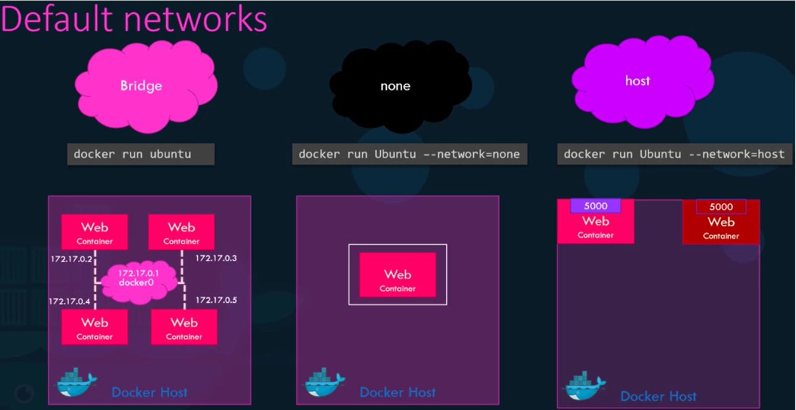

# Lab 1 - Coursera  

## Listing containers 

The ```docker ps``` command lists all running containers and some basic information about them.  
```docker ps -a``` lists all containers.

## Stop container  
```docker stop <container-name>``` stops running container  

## Start container 
```docker start <container>``` - starts existing container (which was created earlier)  

## Remove container  
```docker rm <container>```

## Listing images  
```docker images```

## Removing images  
```docker rmi <image>```  

## only pull the image and not run the container
```docker pull <image>```  

## Exectute a command  
```docker exec distracted_mcclintock cat /etc/hosts```  

* `docker exec`

    * Wykonuje polecenie w działającym kontenerze o nazwie (lub ID) distracted_mcclintock.
* `cat /etc/hosts`

    * Wyświetla zawartość pliku /etc/hosts wewnątrz kontenera. Plik ten zawiera lokalne mapowania adresów IP do nazw hostów

## Attach and detach container. Runs specifying app (runs container from image)  
```docker run <image>```  
```docker run -d <image>``` - detach - (runs in background - the terminal is available)  

### attach back to the running container later:  
```docker attach <container ID>```  

## Interactive terminal  
```docker run -it <image> bash```  

## Diplay  
```cat /etc/*release*``` - dislays the content of the files. Files includes *release* in name  

## Ports
```docker run -p 8080:80 <image>```  
* 8080 - host port  
* 80 - container (app) port 

## Volume mapping  
Synchronization of host and container directories (dir-host:dir-container  image).  
```docker run -v /opt/datadir:/var/lib/mysqql mysql``` - for *mysql* image  

## Inspect (whatever) in JSON
```docker inspect <name-or-ID>```  

## Logs  
```docker logs <image>```  

## container using specified name  
```docker run --name container-name-1 -d <image>```  

## Tags
\<image\> = *repository/image-name:tag*.  Tag indicates the image version, by default is *latest*  
```docker run repo/image-name```

## ENV Variables  
```docker run -e APP_COLOR=blue <image>```  

## Creating image 

### Dockerfile
  
  

## Docker compose  
  
```nano docker-compose.yml```  - creates docker-compose file  
  
```docker-compose up –d``` - runs created docker-compose file   

## Docker Engine  
```docker run --cpus=.5 ubuntu``` - max 50% CPU, ubuntu image  
```docker run --memory=100m ubuntu``` - max 100 MB RAM  

## Volumes  
  

## Networks  
  
```docker network ls``` - lists all networks  
```docker network create --driver bridge --subnet 182.18.0.0/24 --gateway 182.18.0.1 wp-mysql-networ``` - creates new network  
