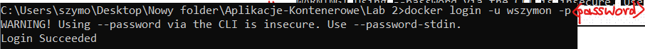
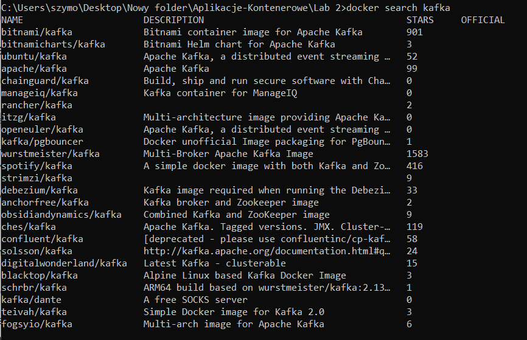
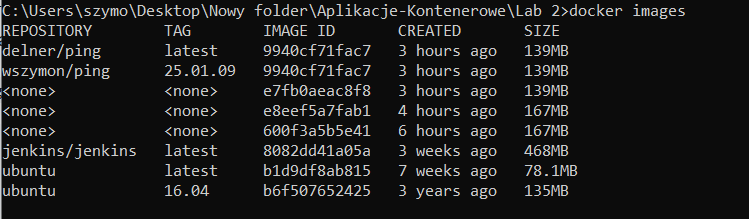
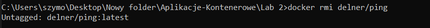
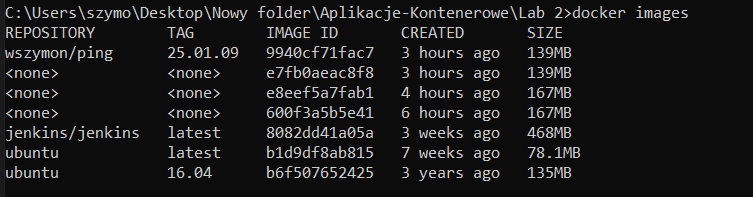
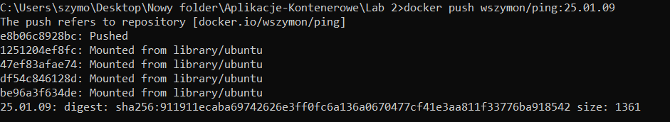

# Lab 2 - Exercise 4: Sharing images  

## Getting Started

Sign in to DockerHub on terminal:  
  
```docker logout``` to logout  

## Finding images

  

## Tagging images

re-tag existed image (creates new one based on other):  
  

  

  

  

## Pushing images

  

  