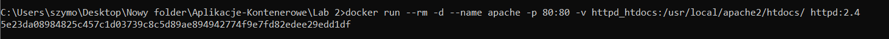

# Lab2 - Exercise 5: Volumes  

## Setting up the server 

  

  

Create *index.html* file in your current directory:  
  

Copies files between the host and containers:  
  
`index.html` - new file  
`apache` is the name of the container we want to copy into.  
`/usr/local/apache2/htdocs/` is where the web server serves HTML from.  
   

result:  

## Managing volumes

  

  

  

  

  

## Mounting volumes on containers

  

  

  

  

  

  

  

## Mounting host directories on containers

  

Now edit your file (*index.html*)  
result:  
  

