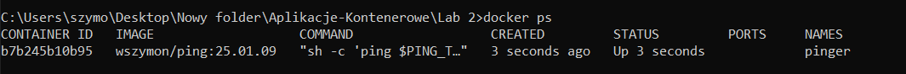

# Lab 2 - Exercise 6: Networking  

## Listing networks

  

## The default `bridge` network  

  

  

  

  

  

  

  

  

  

## Managing custom networks

  

  

  

## Adding containers to a network

  

  
 
  

  

## Connecting between containers in a network

  

  

  

  

## Binding ports to the host

  

  
