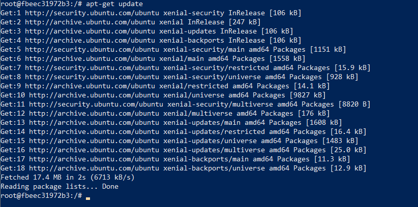

# Lab 2 - Exercise 2: Changing images  

### Getting setup

  

### Modifying an image

  

  

#### Update the list of available software:  

  

#### install the ping command:  

  

#### Ping:  
  
`Ctrl+C` to interrupt.  
Then `exit` the container.  

  

### Committing changes:  

  

#### Commit it as a new image:  

  

  

  

#### Run new image in a new container:

  

