# Lab 2 - Exercise 3: Building images  

## Getting setup  

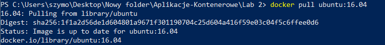  

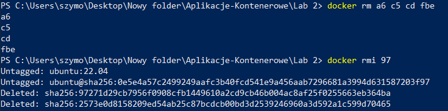  

## Creating a Dockerfile

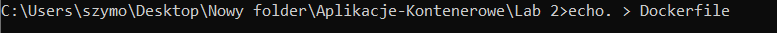  
```echo. > Dockerfile``` - creates new *Dockerfile* file.  

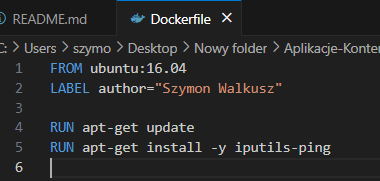  
The `-y` flag avoids that prompt by always answering "*Y*".  

## Building the Dockerfile

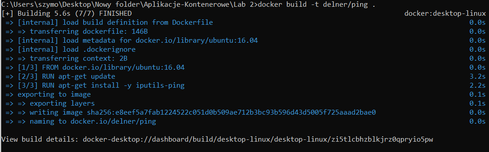  
`.` - indicates the current directory of the *Dockerfile*. If the *Dockerfile* is named else, change it.    
`delner/ping:version` - image tag  
Note: You can repeat aboved command, to create more builds, but it doesn't affect to number of images. Images are not overwritten.  

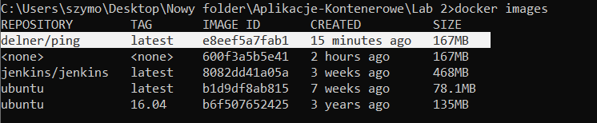  

## Optimizing the Dockerfile  

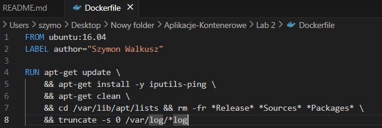  

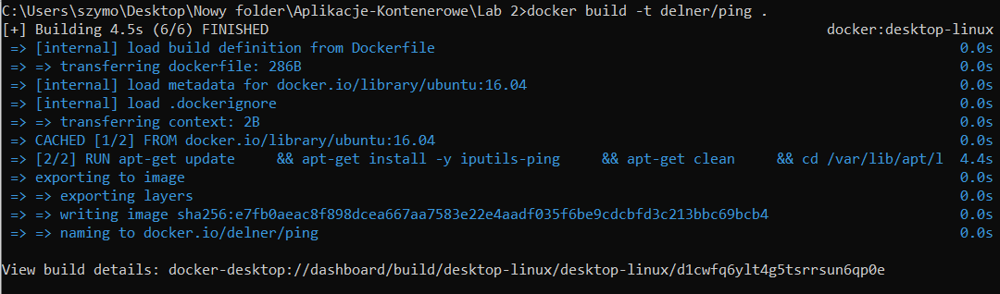  

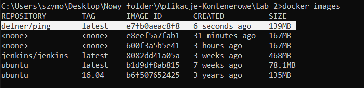  
167MB vs 139MB  
Now the new image is only 4MB larger in size.  

## Other Dockerfile directives  

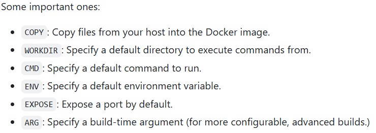  

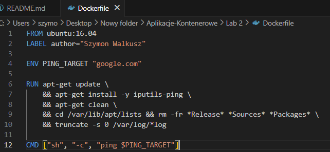  

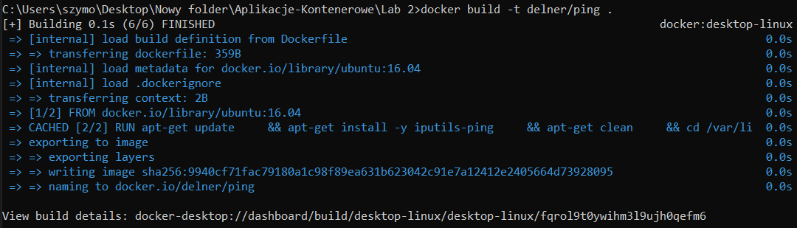  

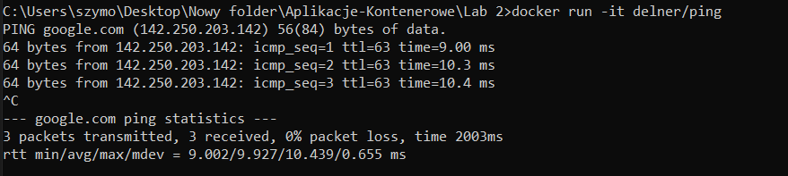  
