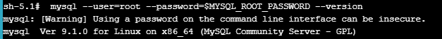
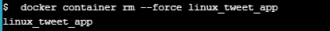
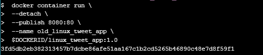

# Docker for Beginners - Linux  

## Task 0: Prerequisites

Clone the Lab’s GitHub Repo:  

## Task 1: Run some simple Docker containers  

### Run a single task in an Alpine Linux container  
Run the following command in your Linux console:  
  
 

List all containers:  
  

### Run an interactive Ubuntu container  
Run a Docker container and access its shell:  
  
 

list the contents of the root directory in the container:  
  
 

show running processes in the container:  
  
 

show which Linux distro the container is running:  
  
 

leave the shell session:  
  
 

check the version of our host VM:  
  

### Run a background MySQL container  
Run a new MySQL container:  
  
 

List the running containers:  
  
 

check what’s happening in your containers:  

  
 

List the MySQL version:  
  
 

connect to a new shell process inside an already-running container:  
  
 

check the version number again:  
  
 

leave the interactive shell session:  
  

## Task 2: Package and run a custom app using Docker  

### Build a simple website image  
get in linux_tweet_app directory:  
  
 

Display the contents of the Dockerfile:  
  
 

export an environment variable containing DockerID:  
  
 

Echo the value of the variable:  
  
 

create a new Docker image using the instructions in the Dockerfile:  
  
 

start a new container from the image:  
  
 

running website:  
  
 

remove container:  
  

## Task 3: Modify a Running Website

### Start our web app with a bind mount
start the web app and mount the current directory into the container:  
  
 

running website:  
  

### Modify the running website  
Copy a new index.html into the container:  
  
 

running changed website:  
  
 

Stop and remove the currently running container:  
  
 

Rerun the current version without a bind mount:  
  
 

wesite went back to first version:  
  
 

Stop and remove the current container:  
  

### Update the image
Build a new image and tag it:  
  
 

images on the system:  
  

### Test the new version
Run a new container from the new version of the image:  
  
 

website 80:  
  
 

Run another new container, this time from the old version of the image:  
  
 

website 8080:  
  

### Push your images to Docker Hub
List the images on your Docker host:  
:  
 

log into Docker Hub:  
  
 

Push version 1.0:  
  