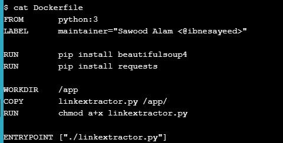
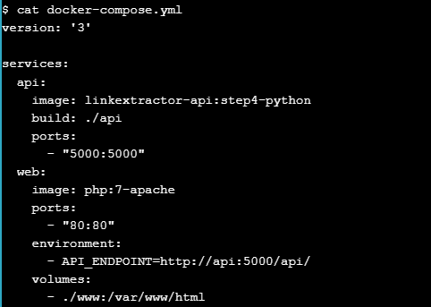

# Application Containerization and Microservice Orchestration  

## Stage Setup

>cloning the demo code repository, changing the working directory, and checking the demo branch out:  
  

## Step 0: Basic Link Extractor Script

>Checkout the step0 branch and list files in it:  
  
 
linkextractor.py content:  
  
 
current permissions on this:  
  

## Step 1: Containerized Link Extractor Script

>Checkout the step1 branch and list files in it:  
  
 
Dockerfile content:  
  
 
build docker image:  
  
 
preview of running images:  
  
 
run a one-off container with this image and extract links from some live web pages:  
  
 
try it on a web page with more links in it:  
  

## Step 2: Link Extractor Module with Full URI and Anchor Text

>Checkout the step2 branch and list files in it:  
  
 
preview of the updated script:  
  
 
build a new image:  
  
 
existed images:  
  
 
Running a one-off container using the linkextractor:step2 image:  
  
 
Running a container using the previous image linkextractor:step1:  
  

## Step 3: Link Extractor API Service

>Checkout the step3 branch and list files in it:  
  
 
Dockerfile:  
  
 
preview main.py:  
  
 
build a new image:  
  
 
run the container:  
  
 
list the rinning containers:  
  
 
HTTP request in the form /api/< url >:  
  
 
container logs:  
  
 
kill and remove this container:  
  

## Step 4: Link Extractor API and Web Front End Services

>Checkout the step4 branch and list files in it:  
  
 
preview docker-compose.yml:  
  
 
bring these services up in detached mode using docker-compose utility:  
  
 
Checking for the list of running containers:  
  
 
talk to the API service:  
  
 
modify the www/index.php file to replace all occurrences of Link Extractor with Super Link Extractor:  
  
 
  
  

## Step 5: Redis Service for Caching

>Checkout the step5 branch and list files in it:  
  
 
inspect the newly added Dockerfile under the ./www folder:  
  
 
API server’s api/main.py file where we are utilizing the Redis cache:  
  
 
updated docker-compose.yml file:  
  
 
boot these services up:
  
 
check whether or not the Redis service is being utilized:  
  
 
  
 
  
  

## Step 6: Swap Python API Service with Ruby

>  
  
  
  
  
  

