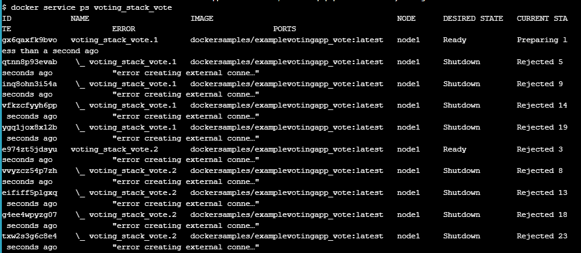

# Swarm stack introduction

## Init your swarm  

## Show members of swarm  
  

## Clone the voting-app  
  

## Deploy a stack  
 

  

check the service within the stack:  
  

list the tasks of the vote service:  
  