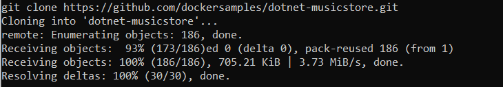
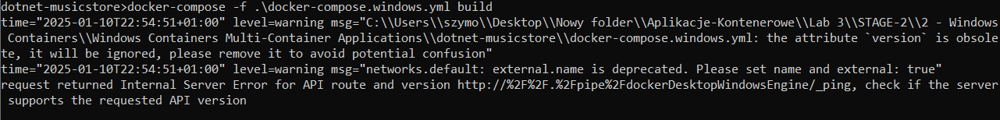
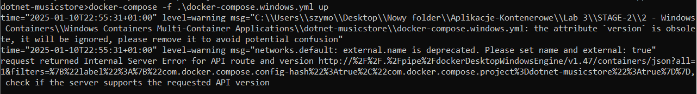

# Windows Containers Multi-Container Applications

Full instruction at: 
https://training.play-with-docker.com/windows-containers-multicontainer/

## Using docker-compose on Windows

  
  
  
  
There is no working instructions