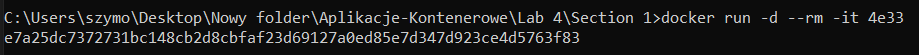

# Section 2

## Exercise 1.3: Secret message

Now that we've warmed up it's time to get inside a container while it's running!

Image devopsdockeruh/simple-web-service:ubuntu will start a container that outputs logs into a file. Go inside the running container and use tail -f ./text.log to follow the logs. Every 10 seconds the clock will send you a "secret message".

Submit the secret message and command(s) given as your answer.  

Pulling the image:  
  
List of images:  
  
Runing a new container:  
  
Getting inside container and trigger `tail -f ./text.log` command:  
  
Exiting from the container:  
  
Stoping container:  
  
List of running containers:  
  
Removing image:  
  

## Exercise 1.4: Missing dependencies  

Start a Ubuntu image with the process `sh -c 'while true; do echo "Input website:"; read website; echo "Searching.."; sleep 1; curl http://$website; done'`

If you're on Windows, you'll want to switch the `'` and `"` around: `sh -c "while true; do echo 'Input website:'; read website; echo 'Searching..'; sleep 1; curl http://$website; done"`.

You will notice that a few things required for proper execution are missing. Be sure to remind yourself which flags to use so that the container actually waits for input.

> Note also that curl is NOT installed in the container yet. You will have to install it from inside of the container.

Test inputting `helsinki.fi` into the application. It should respond with something like

```html
<html>
  <head>
    <title>301 Moved Permanently</title>
  </head>

  <body>
    <h1>Moved Permanently</h1>
    <p>The document has moved <a href="http://www.helsinki.fi/">here</a>.</p>
  </body>
</html>
```

Pulling the image:  
  
running container:  
  
Getting into container and install Curl:  
  
Exit from container:  
  
Testing:  
  


