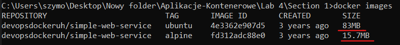

# Section 3  

## Exercise 1.5: Sizes of images  

Pull both images:  
  

compare the image sizes:  
  

Ruing container:  

Getting into container, trigger log file and exit the container:  

## Exercise 1.6: Hello Docker Hub

## Exercise 1.7: Image for script

  
  
  
  

## Exercise 1.8: Two line Dockerfile

