running ubuntu:22.04 and installing `curl`  
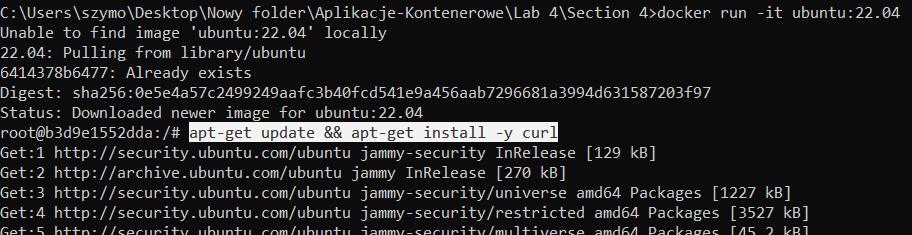

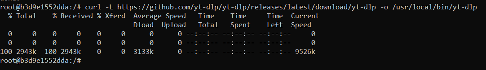  

add permissions:  
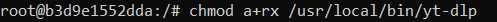  
installing python:  
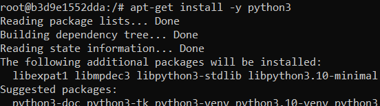  
run the app:  
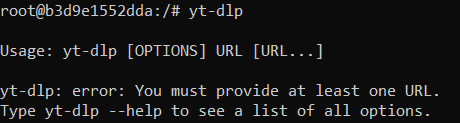

## Version 1 - CMD

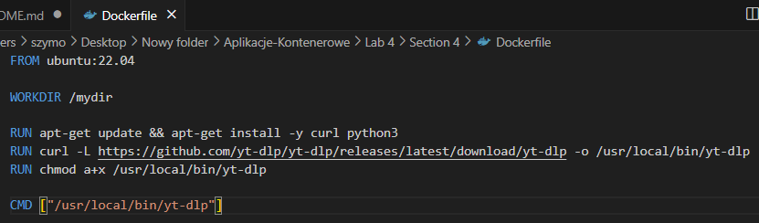

```docker build -t yt-dlp .```   
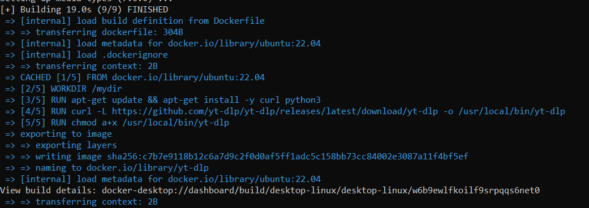

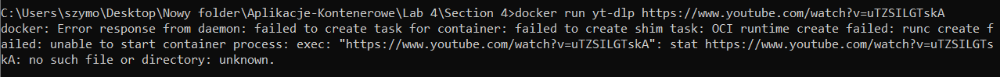  

## Version 2 - CMD replaced by ENRTYPOINT

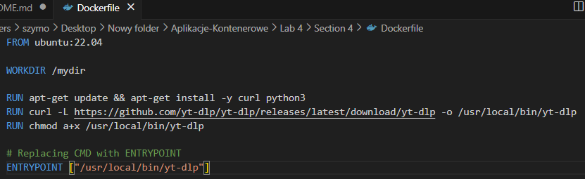  
building from Docker file:  
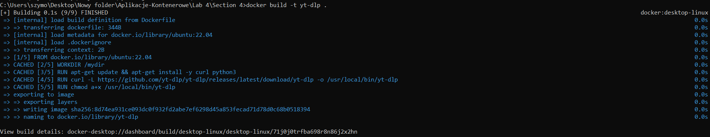  
runnung app:  
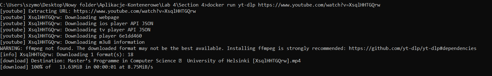

## Version 3 - CMD + ENTRYPOINT

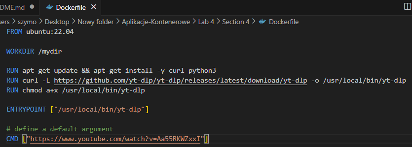  
building from Docker file:  

runnung app:  
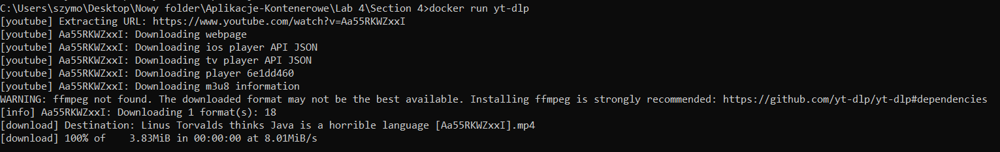
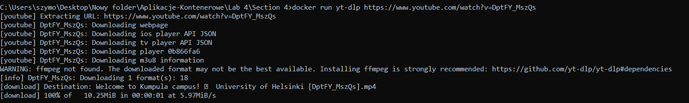

## Python 

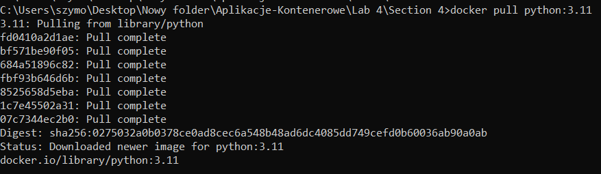
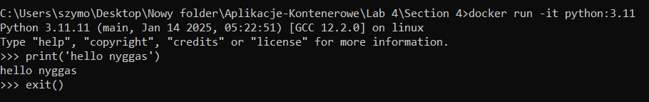
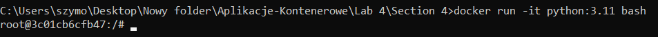
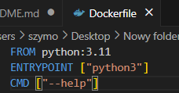
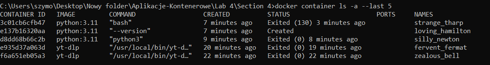
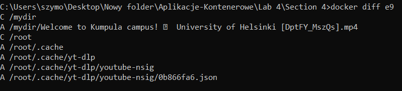
copying to host from container:  
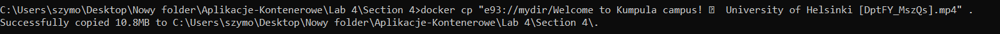
