`Dockerfile`:  
```dockerfile
FROM ubuntu:22.04

WORKDIR /mydir

RUN apt-get update && apt-get install -y curl python3
RUN curl -L https://github.com/yt-dlp/yt-dlp/releases/latest/download/yt-dlp -o /usr/local/bin/yt-dlp
RUN chmod a+x /usr/local/bin/yt-dlp

ENTRYPOINT ["/usr/local/bin/yt-dlp"]
```  

`docker-compose.yml`:  
```yml
version: '3.8'

services:
  yt-dlp-ubuntu:
    image: wszymon/lab5
    build: .
```  

```bash
docker compose build
```  
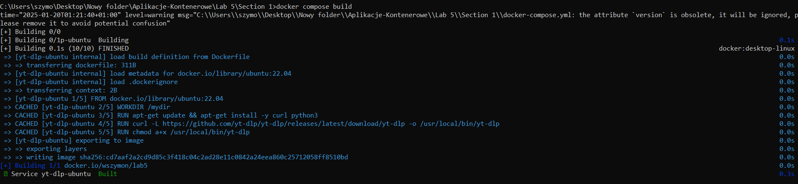  
```
docker compose push
```  
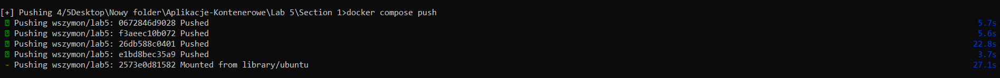  
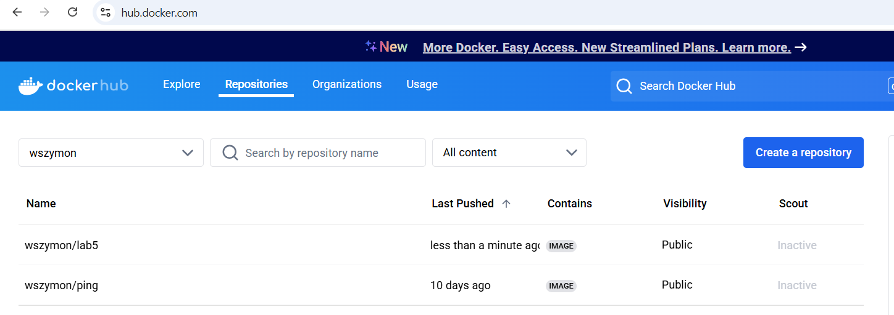  


## Volumes in Docker Compose

```yml
version: '3.8'

services:

  yt-dlp-ubuntu:
    image: wszymon/lab5
    build: .
    volumes:
      - .:/mydir
    container_name: yt-dlp
```  

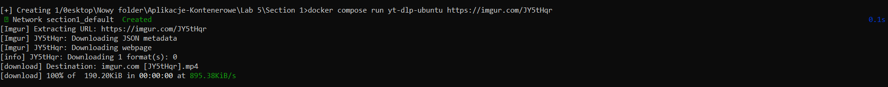  
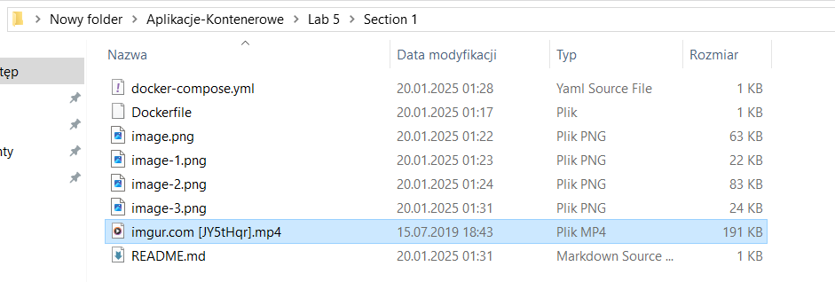  

## Exercise 2.1

`docker-compose.yml`:  
```yml
services:
  simple-web-service:
    image: devopsdockeruh/simple-web-service
    container_name: simple-web-service
    volumes:
      - ./logs/text.log:/usr/src/app/text.log
    ports:
      - "8080:8080"
```  
create folder:  
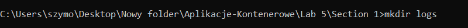  
create file:  
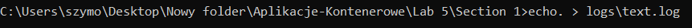  
`docker compose up`:  
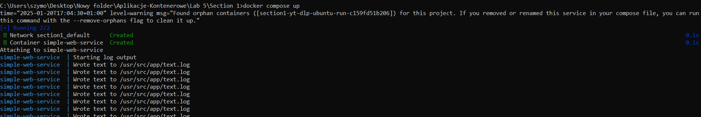  
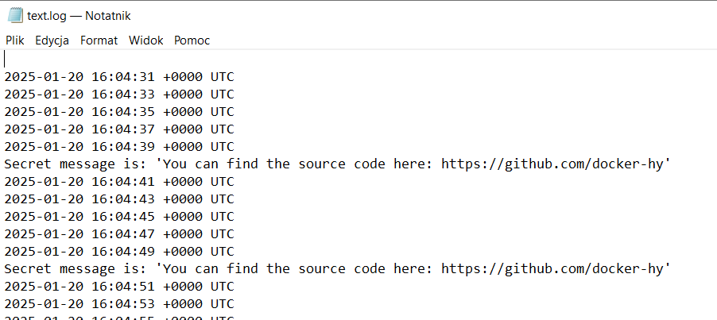  

## Exercise 2.2  

`docker-compose.yml`:  
```yml
services:
  simple-web-service:
    image: devopsdockeruh/simple-web-service
    container_name: simple-web-service
    command: server
    ports:
      - "8080:8080"
```  

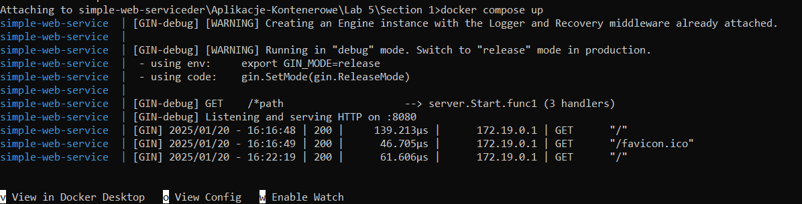  
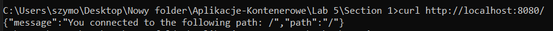  
