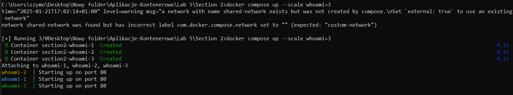
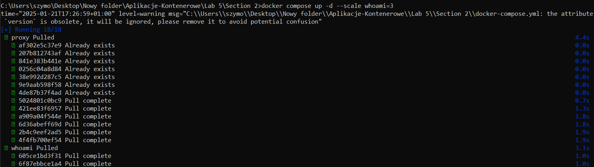
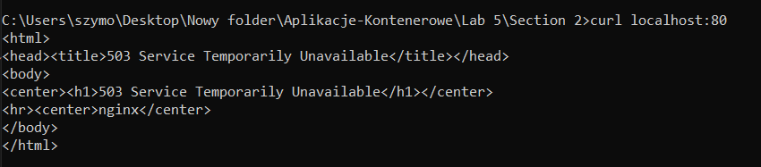
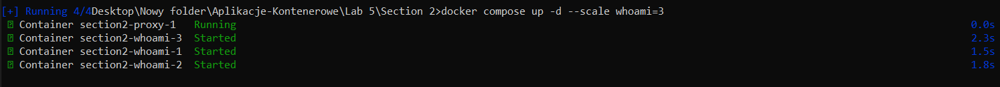
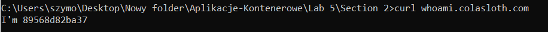
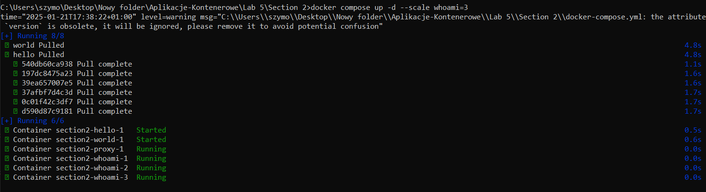
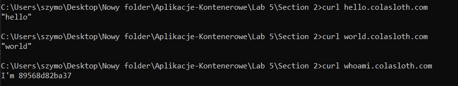

`dockercompose.yml`:  
```yml
services:
  whoami:
    image: containous/whoami
    ports:
      - 8000
    networks:
      - custom-network

networks:
  custom-network:
    external:
      name: shared-network
```

```sh
docker network create shared-network
```

```sh
docker compose up --scale whoami=3
```

  


  
  


`dockercompose.yml`:  
```yml
version: "3.8"

services:
  whoami:
    image: jwilder/whoami
    environment:
      - VIRTUAL_HOST=whoami.colasloth.com
  proxy:
    image: jwilder/nginx-proxy
    volumes:
      - /var/run/docker.sock:/tmp/docker.sock:ro
    ports:
      - 80:80
```
  
  


## final version:  
```sh
echo "hello" > hello.html
echo "world" > world.html  
```

`dockercompose.yml`:  
```yml
version: "3.8"

services:
  whoami:
    image: jwilder/whoami
    environment:
      - VIRTUAL_HOST=whoami.colasloth.com
  proxy:
    image: jwilder/nginx-proxy
    volumes:
      - /var/run/docker.sock:/tmp/docker.sock:ro
    ports:
      - 80:80
  hello:
    image: nginx:1.19-alpine
    volumes:
      - ./hello.html:/usr/share/nginx/html/index.html:ro
    environment:
      - VIRTUAL_HOST=hello.colasloth.com
  world:
    image: nginx:1.19-alpine
    volumes:
      - ./world.html:/usr/share/nginx/html/index.html:ro
    environment:
      - VIRTUAL_HOST=world.colasloth.com
``` 

```sh
docker compose up -d --scale whoami=3
```  
  
