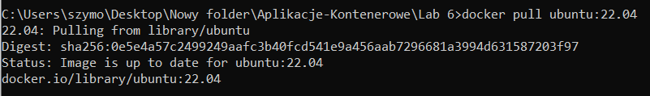
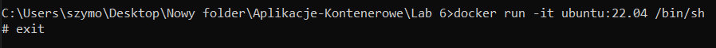
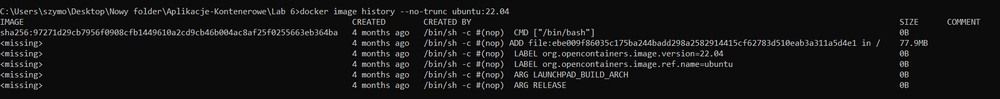
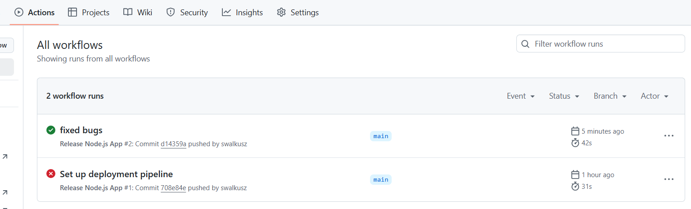
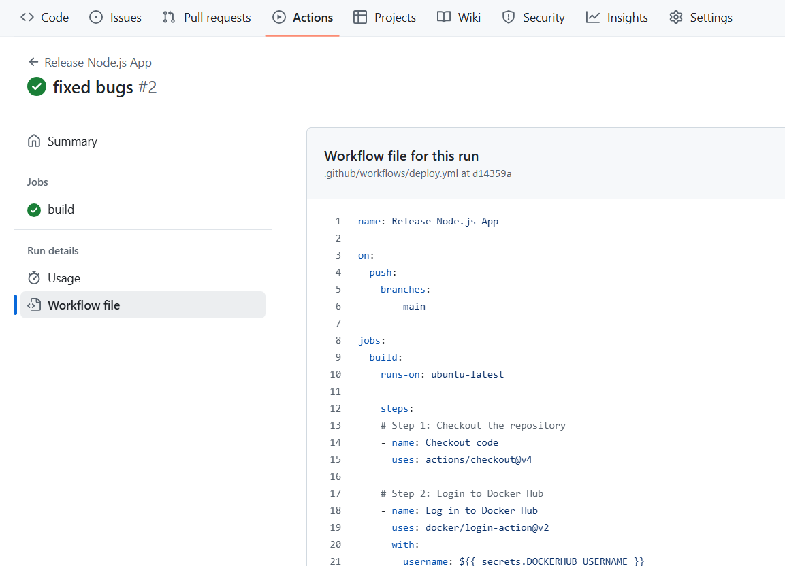
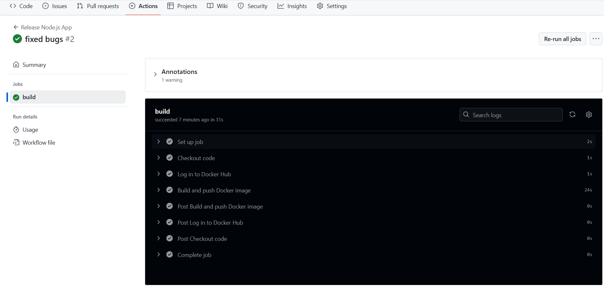
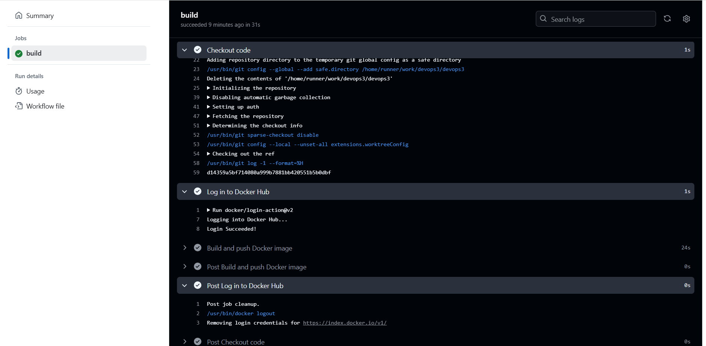
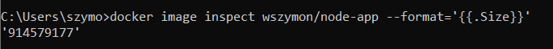

# Section 1  

  
  
  

# Section 2  

  
  
  
  

# Section 3

`Dockerfile`:
```Dockerfile
FROM golang:1.16 AS build

WORKDIR /app
COPY . ./
RUN CGO_ENABLED=0 GOOS=linux go build -o server

FROM alpine:latest

WORKDIR /app
# Create the non-root user and set permissions
RUN addgroup -S appgroup && adduser -S appuser -G appgroup && \
    chown -R appuser:appgroup /app

# Copy the built binary from the previous stage
COPY --from=build /app/server ./ 

# Install certificates and clean up
RUN apk --no-cache add ca-certificates && \
    rm -rf /var/cache/apk/*

USER appuser

ENV PORT=8080 REQUEST_ORIGIN=http://localhost \
    REDIS_HOST=redis POSTGRES_HOST=postgres \
    POSTGRES_USER=postgres POSTGRES_PASSWORD=postgres \
    POSTGRES_DATABASE=messages

EXPOSE 8080
CMD ["./server"]
```

  

```Dockerfile
FROM node:16 AS build

WORKDIR /app
COPY public ./public
COPY src ./src
COPY package.json ./package.json
COPY package-lock.json ./package-lock.json
RUN npm install && \
    REACT_APP_BACKEND_URL=http://localhost/api npm run build

FROM node:16-slim

# Create /app directory and a non-root user
WORKDIR /app
RUN mkdir -p /app/build && \
    addgroup --system appgroup && \
    adduser --system --ingroup appgroup appuser && \
    npm install -g serve && \
    chown -R appuser:appgroup /app && \
    rm -rf /root/.npm /tmp/*

# Copy the build artifacts
COPY --from=build /app/build /app/build

USER appuser
EXPOSE 5000
CMD ["serve", "-s", "-l", "5000", "/app/build"]
```  

```Dockerfile
FROM golang:1.20-alpine as builder
WORKDIR /app

COPY go.mod go.sum ./
RUN go mod download

COPY . .
RUN go build -o main .

FROM alpine:latest
WORKDIR /root/

COPY --from=builder /app/main .

EXPOSE 8080
CMD ["./main"]
```

```Dockerfile
FROM node:16-alpine AS build
WORKDIR /app

COPY package*.json ./
RUN npm install

COPY . . 
RUN REACT_APP_BACKEND_URL=http://localhost/api npm run build

FROM nginx:alpine
WORKDIR /usr/share/nginx/html

COPY --from=build /app/build .

EXPOSE 80
CMD ["nginx", "-g", "daemon off;"]
```